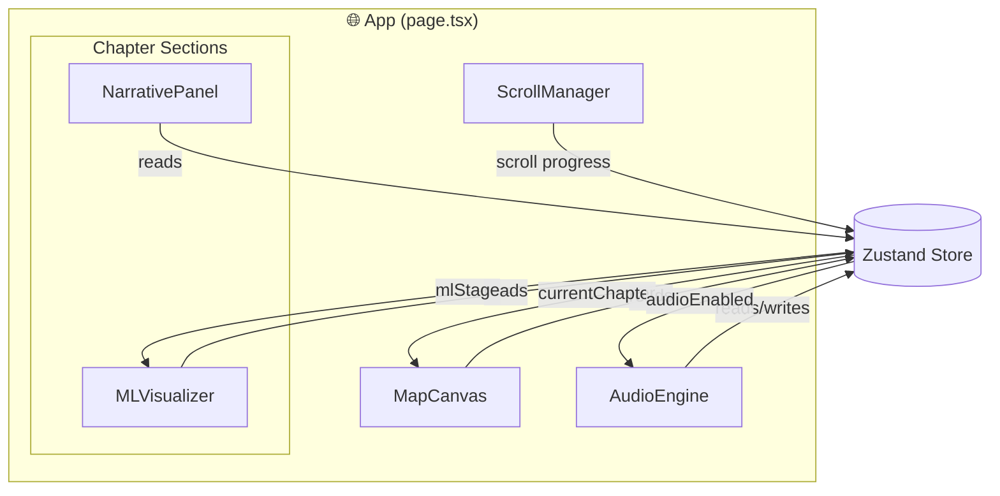
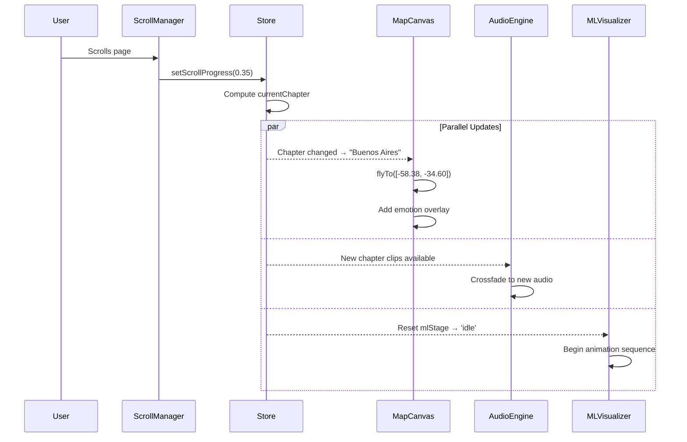
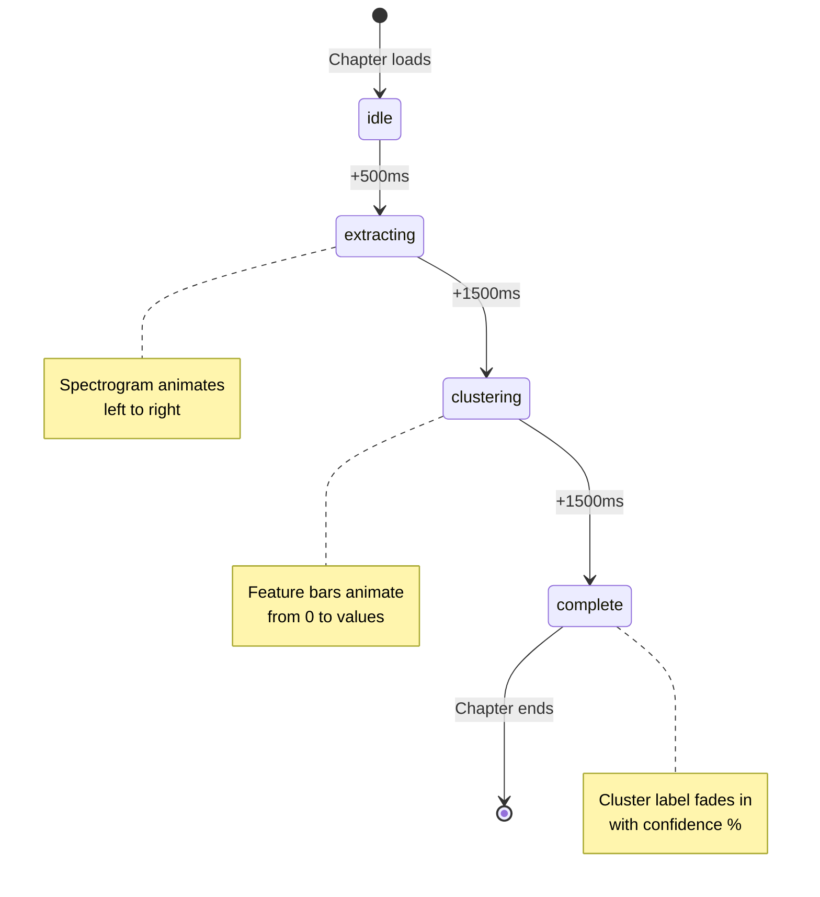
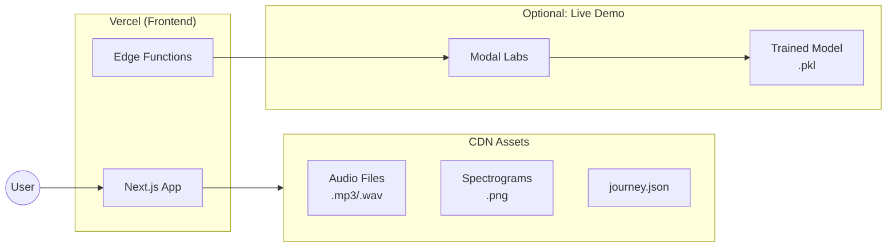

# Emotional Cartography - Visual Diagrams

## 1. Component Hierarchy



## 2. Data Flow



## 3. ML Pipeline Animation Sequence



## 4. Layout Structure (Desktop)

```
┌─────────────────────────────────────────────────────────────────────────┐
│ HERO (100vh)                                                            │
│ ┌─────────────────────────────────────────────────────────────────────┐ │
│ │                                                                     │ │
│ │              "Emotional Cartography"                                │ │
│ │              I recorded vlogs across 5 countries...                 │ │
│ │                        ↓ Scroll                                     │ │
│ │                                                                     │ │
│ └─────────────────────────────────────────────────────────────────────┘ │
├─────────────────────────────────────────────────────────────────────────┤
│ CHAPTER 1: Singapore (100vh)                                            │
│ ┌────────────────────────────────┬────────────────────────────────────┐ │
│ │                                │  ┌──────────────────────────────┐  │ │
│ │     MAP CANVAS                 │  │  Singapore                   │  │ │
│ │     (fixed, shows through)     │  │  ───────────                 │  │ │
│ │                                │  │  "Where it began"            │  │ │
│ │     [emotion overlay           │  │                              │  │ │
│ │      blooms here]              │  │  Home. The familiar...       │  │ │
│ │                                │  │                              │  │ │
│ │            🔵                  │  │  ┌────────────────────────┐  │  │ │
│ │                                │  │  │ [SPECTROGRAM]          │  │  │ │
│ │                                │  │  │ [FEATURES]             │  │  │ │
│ │                                │  │  │ Cluster: Grounded (78%)│  │  │ │
│ │                                │  │  └────────────────────────┘  │  │ │
│ │                                │  └──────────────────────────────┘  │ │
│ └────────────────────────────────┴────────────────────────────────────┘ │
├─────────────────────────────────────────────────────────────────────────┤
│ CHAPTER 2: [Country 2] (100vh)                                          │
│ ... same structure ...                                                   │
├─────────────────────────────────────────────────────────────────────────┤
│ CONCLUSION (100vh)                                                       │
│ ┌─────────────────────────────────────────────────────────────────────┐ │
│ │                                                                     │ │
│ │              "What the Machine Learned"                             │ │
│ │              Agglomerative clustering worked best...                │ │
│ │                                                                     │ │
│ │              "The process of systematizing something as messy       │ │
│ │               as emotion taught me that even the most human         │ │
│ │               problems can benefit from structure—if you            │ │
│ │               approach them with humility."                         │ │
│ │                                                                     │ │
│ └─────────────────────────────────────────────────────────────────────┘ │
├─────────────────────────────────────────────────────────────────────────┤
│ AUDIO BAR (fixed bottom)                                                │
│ ┌─────────────────────────────────────────────────────────────────────┐ │
│ │  ▁▂▃▄▅▆▇█▇▆▅▄▃▂▁▂▃▄▅▆▇█▇▆▅▄▃▂▁▂▃▄▅▆▇█▇▆▅▄▃▂▁▂▃▄▅▆▇█▇▆▅▄▃▂▁    🔊  │ │
│ └─────────────────────────────────────────────────────────────────────┘ │
└─────────────────────────────────────────────────────────────────────────┘
```

## 5. Deployment Architecture



## 6. Scroll Timeline Mapping

```
Scroll Progress: 0% -------- 15% -------- 35% -------- 55% -------- 75% -------- 90% -------- 100%
                  |           |           |           |           |           |           |
Chapter:        HERO    Singapore    Country2    Country3    Country4    Country5    CONCLUSION
                  |           |           |           |           |           |           |
Map Camera:     World      Zoom→SG    Fly→C2     Fly→C3     Fly→C4     Fly→C5     Zoom out
                  |           |           |           |           |           |           |
Audio:          Silent    Clips 1-3   Clips 4-6  Clips 7-9  Clips 10-12 Clips 13-15 Silent
                  |           |           |           |           |           |           |
Emotion Color:    -        #4A90D9     #FF6B6B    #4ECDC4    #FFE66D    #95E1D3      -
```

## 7. Color System Reference

```css
/* Emotion Cluster Colors - Derived from your clustering results */

Cluster A: "Energetic/Excited"    → #FF6B6B (warm coral)
Cluster B: "Calm/Reflective"      → #4ECDC4 (soft teal)
Cluster C: "Neutral/Observational"→ #FFE66D (warm yellow)
Cluster D: "Contemplative"        → #95E1D3 (sea foam)

/* Each cluster should feel distinct but harmonious */
/* Consider your actual data when finalizing these */
```

## 8. Mobile Adaptation

```
┌─────────────────────┐
│ MAP (40vh, fixed)   │
│                     │
│      [overlay]      │
│         🔵          │
│                     │
├─────────────────────┤
│                     │
│  Singapore          │
│  ───────────        │
│  "Where it began"   │
│                     │
│  Home. The          │
│  familiar...        │
│                     │
│  ┌───────────────┐  │
│  │ ▼ ML Details  │  │ ← Expandable accordion
│  └───────────────┘  │
│                     │
├─────────────────────┤
│ ▁▂▃▄▅▆▇█▇▆▅▄   🔊  │
└─────────────────────┘
```

---

## Quick Reference: Z-Index Layers

| Layer | Z-Index | Element |
|-------|---------|---------|
| Background | 0 | MapCanvas (fixed) |
| Content | 10 | Chapter sections |
| Overlay | 20 | NarrativePanel cards |
| Controls | 50 | AudioEngine bar |
| Modal | 100 | (future: settings, etc.) |

---

## Performance Checklist

- [ ] Lazy load audio files (only load current + next chapter)
- [ ] Use `loading="lazy"` on spectrogram images
- [ ] Code-split MapCanvas and Three.js components
- [ ] Pre-compute all waveform data (don't analyze at runtime)
- [ ] Use `will-change: transform` on animated elements
- [ ] Debounce scroll handler (GSAP scrub handles this)
- [ ] Test on 3G throttled connection
- [ ] Target: First Contentful Paint < 1.5s, TTI < 3s
